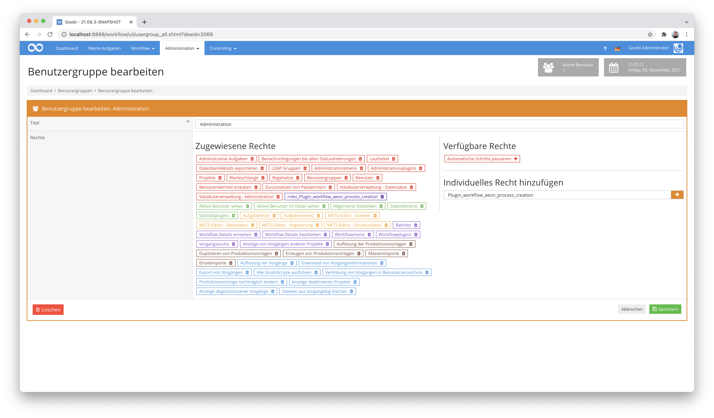
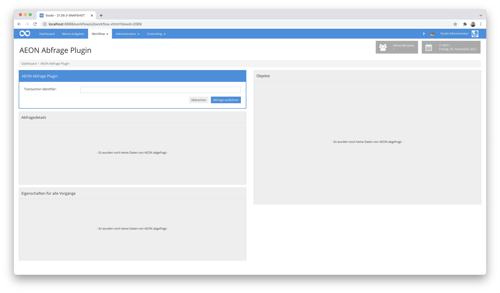
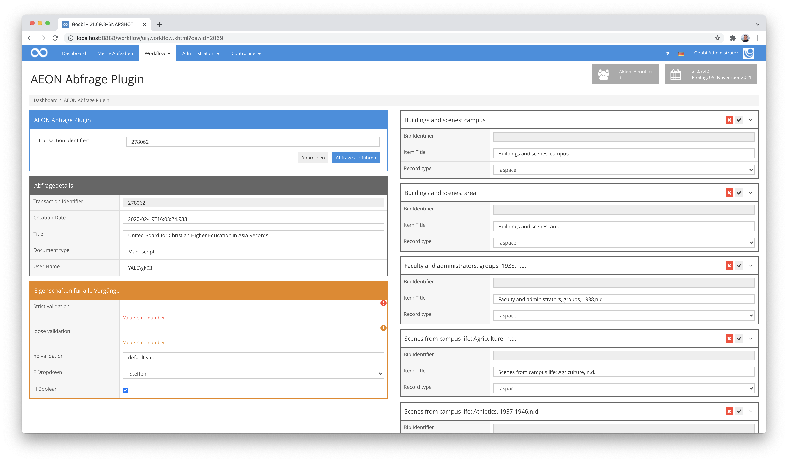
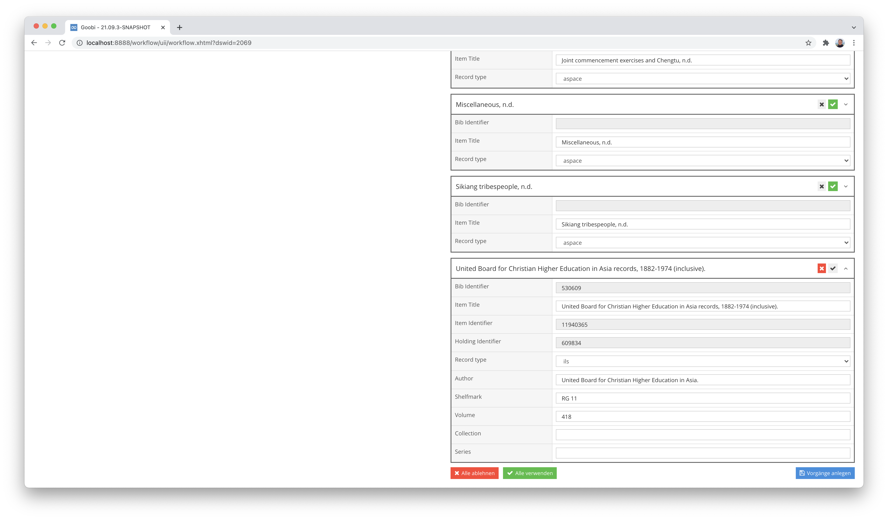
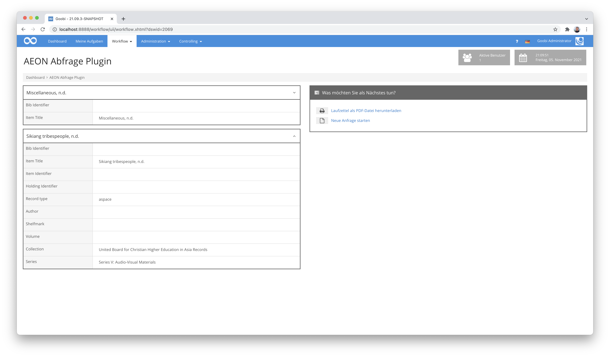

goobi-plugin-workflow-aeon-process-creation
===========================================================================


Einführung
---------------------------------------------------------------------------
Mit diesem Plugin können einzelne Datensätze aus AEON abgefragt werden. Nachdem ein Datensatz abgefragt wurde, werden alle Metadaten aus der sog. Metadata Cloud abgefragt und aufgelistet. Der Nutzer kann anschließend auswählen, welche Datensätze er als Goobi-Vorgang anlegen möchte.


Übersicht
---------------------------------------------------------------------------

Details             |  Erläuterung
------------------- | -----------------------------------------------------
Identifier          | intranda_workflow_aeon_process_creation
Source code         | [https://github.com/intranda/goobi-plugin-workflow-aeon-process-creation](https://github.com/intranda/goobi-plugin-workflow-aeon-process-creation)
Lizenz              | GPL 2.0 oder neuer 
Dokumentationsdatum | 05.11.2021 


Installation
---------------------------------------------------------------------------
Das Plugin besteht insgesamt aus den folgenden zu installierenden Dateien:

```text
plugin_intranda_workflow_aeon_process_creation.jar
plugin_intranda_workflow_aeon_process_creation-GUI.jar
plugin_intranda_workflow_aeon_process_creation.xml
```

Diese Dateien müssen in den richtigen Verzeichnissen installiert werden, so dass diese nach der Installation unter den folgenden Pfaden vorliegen:

```bash
/opt/digiverso/goobi/plugins/workflow/plugin_intranda_workflow_aeon_process_creation.jar
/opt/digiverso/goobi/plugins/GUI/plugin_intranda_workflow_aeon_process_creation-GUI.jar
/opt/digiverso/goobi/config/plugin_intranda_workflow_aeon_process_creation.xml
```


Konfiguration
---------------------------------------------------------------------------
Die Konfiguration des Plugins erfolgt über die Konfigurationsdatei `plugin_intranda_workflow_aeon_process_creation.xml` und kann im laufenden Betrieb angepasst werden. Im folgenden ist eine beispielhafte Konfigurationsdatei aufgeführt:

```xml
<config_plugin>
    <aeon>
        <url>https://example.com/api</url>
        <username>username</username>
        <password>password</password>
    </aeon>

    <processCreation>
        <workflowName>digitisation on demand</workflowName>
        <opacName>metadata cloud</opacName>
    </processCreation>

    <transaction>
        <field aeon="transactionNumber">
            <title>Transaction Identifier</title>
            <type readonly="true">input</type>
            <variable place="process">Transaction Identifier</variable>
            <help>This is my description for the field so that everyone gets some help.</help>
            <validation strict="true">\d+</validation>
            <message>Your content does not follow our validation guidelines</message>
        </field>

        <field aeon="creationDate">
            <title>Creation Date</title>
            <type readonly="false">input</type>
            <variable place="process">Creation date</variable>
            <help>This is my description for the field so that everyone gets some help.</help>
            <message>Your content does not follow our validation guidelines</message>
        </field>

        <field aeon="itemTitle">
            <title>Title</title>
            <type readonly="false">input</type>
            <variable place="process">Main title</variable>
            <value>Transmission</value>
            <help>This is my description for the field so that everyone gets some help.</help>
        </field>

        <field aeon="documentType">
            <title>Document type</title>
            <type readonly="false">input</type>
            <variable place="process">Doc type</variable>
            <help>This is my description for the field so that everyone gets some help.</help>
        </field>
    
        <field aeon="username">
            <title>User Name</title>
            <type readonly="false">input</type>
            <variable place="process">User</variable>
            <help>This is my description for the field so that everyone gets some help.</help>
        </field>
    </transaction>

    <properties>
        <field>
            <title>Strict validation example</title>
            <type readonly="false">input</type>
            <variable place="process">Strict field</variable>
            <value>no numeric value</value>            
            <help>This is my description for the field so that everyone gets some help.</help>
            <validation strict="true">\d+</validation>
            <message>Value is no number</message>
        </field>

        <field>
            <title>Loose validation example</title>
            <type readonly="false">input</type>
            <variable place="process">Loose field</variable>
            <value>no numeric value</value>
            <help>This is my description for the field so that everyone gets some help.</help>
            <validation strict="false">\d+</validation>
            <message>Value is no number</message>
        </field>

        <field>
            <title>no validation example</title>
            <type readonly="false">input</type>
            <variable place="process">Text field</variable>
            <value>default value</value>
            <help>This is my description for the field so that everyone gets some help.</help>
            <message>Your content does not follow our validation guidelines</message>
        </field>
        <field>
            <title>Dropdown example</title>
            <type readonly="false">select</type>
            <variable place="work">CoWorker</variable>
            <value>Steffen</value>
            <select>Steffen</select>
            <select>Oliver</select>
            <select>Robert</select>
            <help>This is my description for the field so that everyone gets some help.</help>
        </field>

        <field>
            <title>Vocabulary example</title>
            <type readonly="false">vocabulary</type>
            <variable place="work">Vocabulary</variable>
            <vocabularyName>Subject terms</vocabularyName>
            <vocabularyField>type=Person</vocabularyField>
            <help>This is my description for the field so that everyone gets some help.</help>
        </field>
        <field>
            <title>Boolean example</title>
            <type readonly="false">checkbox</type>
            <variable place="process">Status</variable>
            <value>true</value>
            <help>This is my description for the field so that everyone gets some help.</help>
        </field>
    </properties>
    
    <processes>
        <field aeon="bibId" displayAlways="true" displayInTitle="false">
            <title>Bib Identifier</title>
            <type readonly="true">input</type>
            <variable place="process">Text field</variable>
            <help>This is my description for the field so that everyone gets some help.</help>
        </field>
        <field aeon="title" displayAlways="true" displayInTitle="true">
            <title>Item Title</title>
            <type readonly="false">input</type>
            <variable place="process">Text field</variable>
            <help>This is my description for the field so that everyone gets some help.</help>
        </field>
        <field aeon="itemId" displayAlways="false" displayInTitle="false">
            <title>Item Identifier</title>
            <type readonly="true">input</type>
            <variable place="process">Text field</variable>
            <help>This is my description for the field so that everyone gets some help.</help>
        </field>
            <field aeon="holdingId" displayAlways="false" displayInTitle="false">
            <title>Holding Identifier</title>
            <type readonly="true">input</type>
            <variable place="process">Text field</variable>
            <help>This is my description for the field so that everyone gets some help.</help>
        </field>
        <field aeon="recordType" displayAlways="false" displayInTitle="false">
            <title>Record type</title>
            <type readonly="false">select</type>
            <variable place="work">publication</variable>
            <select>ils</select>
            <select>aspace</select>
            <help>This is my description for the field so that everyone gets some help.</help>
        </field>
        <field aeon="collection" displayAlways="false" displayInTitle="false">
            <title>Collection</title>
            <type readonly="false">input</type>
            <variable place="work">Text field</variable>
            <help>This is my description for the field so that everyone gets some help.</help>
        </field>
    </processes>
</config_plugin>
```

Innerhalb des Bereiches `<aeon>` werden die Zugangsdaten verwaltet. Hier müssen die URL zur RESTful API von AEON sowie Nutzername und Passwort hinterlegt werden. Soll alternativ ein Key für die Verwendung der API genutzt werden muss dieser angegeben werden.

Im Block `<processCreation>` kann definiert werden, welche OPAC-Konfiguration zur Anfrage von Katalogdaten genutzt werden soll und auf Basis welcher Produktionsvorlage die einzelnen Vorgänge erzeugt werden sollen.

Anschließend erfolgt die Konfiguration der angezeigten und importierbaren Felder. Dies ist in 3 Bereiche aufgeteilt. Der Bereich `<transaction>` enthält diejenigen Felder, die aus dem AEON-Record gelesen werden. Der Bereich `<properties>` enthält frei definierbare Eigenschaften, die zu den zu erzeugenden Vorgängen gehören. Und der Bereich `<processes>` enthält die Felder, die bei der Abfrage der Daten aus der Metadata Cloud bezogen wurden.

Die Konfiguration innerhalb der drei Bereiche ist annähernd identisch. Jedes Feld wird jeweils durch ein  Element `<field>` definiert. Innerhalb davon sind anschließend folgende Möglichkeiten vorgesehen:

Parameter           |  Erläuterung
------------------- | ----------------------------------------------------- 
`title`             | Anzeigename des Feldes
`type`              | Typ des Feldes, mögliche Werte sind `input`, `select`, `vocabulary`, `checkbox`
`readonly`          | Die Werte `true` oder `false` definieren, ob der Inhalt des Feldes bearbeitet werden darf.
`aeon`              | Name des json Elements, aus dem das Feld befüllt wird. Dieser Parameter wird für die frei definierbare Eigenschaften nicht ausgewertet.
`displayAlways`     | Die Werte `true` oder `false` definieren, ob das Feld angezeigt wird, wenn nur ein minimierter Datensatz angezeigt wird. Dieser Parameter wird ausschließlich für die Felder aus der Metadata Cloud ausgewertet.
`displayInTitle`    | Die Werte `true` oder `false` definieren, ob das Feld innerhalb der Kopfzeile der Box aufgeführt wird. Dieser Parameter wird ausschließlich für die Felder aus der Metadata Cloud ausgewertet.
`variable`          | Dieser Parameter definiert den Namen der zu erstellenden Eigenschaft. Dieser Parameter wird für Daten aus der Metadata Cloud nicht ausgewertet.
`place`             | Hier wird der Typ der Eigenschaft festgelegt. Mögliche Werte sind `work` (Werkstückeigenschaft), `process` (Vorgangseigenschaft), `template` (Vorlageneigenschaft).
`value`             | Mit diesem Parameter kann ein Default Wert festgelegt werden. Falls ein AEON Element konfiguriert und durch die Abfrage erhalten wurde, wird der konfigurierte default Wert mit dem Inhalt aus AEON überschrieben.
`help`              | Mit diesem Parameter läßt sich ein Hilfetext definieren der optional angezeigt werden kann.
`validation`        | Dieser Parameter definiert einen regulären Ausdruck, gegen den der Feldinhalt validiert werden kann.
`strict`            | Die Werte `true` oder `false` definieren, ob ein Verstoß gegen die Validierung zwingend behoben werden muss, bevor Vorgänge angelegt werden können. 
`message`           | Dieser Parameter legt eine Meldung fest, die im Falle von Validierungsfehlern angezeigt werden soll.
`vocabularyName`    | Dieser Parameter definiert ein zu nutzendes Vokabular. 
`vocabularyField`   | Mit dem Parameter `fieldname=value` kann das Trefferset auf Werte eingeschränkt werden, die diese Definition erfüllen. Das Feld ist wiederholbar, um mehrere Einschränkungen gleichzeitig zu definieren.

Einrichtung benötigter Berechtigungen
---------------------------------------------------------------------------
Dieses Plugin verfügt über eine eigene Berechtigungsstufe für die Verwendung. Aus diesem Grund müssen Nutzer über die erforderlichen Rechte verfügen. Bitte weisen Sie daher der Benutzergruppe der entsprechenden Nutzer das folgende Recht zu:

```
Plugin_workflow_aeon_process_creation
```




Arbeitsweise des Plugins
---------------------------------------------------------------------------

Wenn der Nutzer über die Berechtigung zur Nutzung des Plugins verfügt, kann Im Menüpunkt Worklow das Plugin `AEON Abfrage Plugin` geöffnet werden.



Hier kann nun ein Transaction identifier eingetragen werden, um die Suche nach einem AEON-Record zu starten.



Wenn eine erfolgreiche Suche durchgeführt wurde, wurde der Bereich `Abfragedetails` mit den Feldern gefüllt, die innerhalb der Konfiguration im Bereich `<transaction>` festgelegt wurden. Im Bereich `Eigenschaften für alle Vorgänge` werden die frei definierbaren Eigenschaften aus dem Konfigurationsbereich `<properties>` angezeigt.

Diese Felder lassen sich bearbeiten, sofern dies in der Konfigurationsdatei vorgesehen wurde. Verstöße gegen die Validierung werden unmittelbar bei den einzelnen Feldern angezeigt.

Im rechten Bereich der Nutzeroberfläche werden die einzelnen ermittelten Datensätze aufgelistet, die innerhalb der Metadata Cloud zu dem Barcode des AEON-Records gefunden wurden. Jede Box stellt hierbei einen eigenständigen Datensatz dar. Mehr Details eines Datensatzes lassen sich anzeigen, indem weitere Felder der Boxen ausgeklappt werden. Über die entsprechenden Icons pro Box lassen sich diejenigen Datensätze auswählen, für die Vorgänge in Goobi erzeugt werden sollen.



Sofern mindestens ein Datensatz ausgewählt wurde und keine unerfüllten strikten Validierungen vorliegen, lassen sich mittels Klick auf den Button `Vorgänge anlegen` die einzelnen Goobi-Vorgänge für die ausgewählten Datensätze auf der Basis der konfigurierten Produktionsvorlage anlegen. Anschließend gelangt der Nutzer somit auf eine weitere Ansicht.



Hier werden im linken Bereich noch einmal diejenigen Datensätze aufgeführt, für die Vorgänge in Goobi angelegt wurden. Im rechten Bereich steht die Möglichkeit zur Verfügung einen Laufzettel für alle erzeugten Vorgänge zu generieren und herunterzuladen, wo die zugehörigen Vorgänge alle innerhalb eines gemeinsamen Batches zusammengefasst aufgeführt werden.