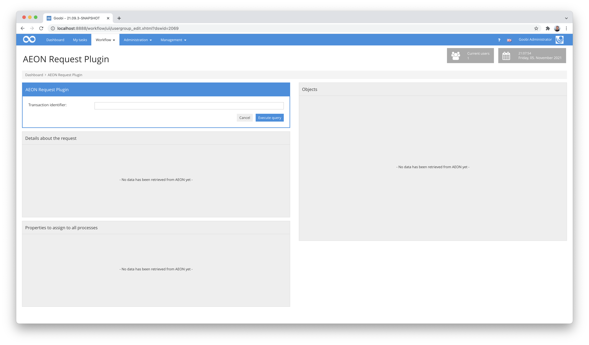
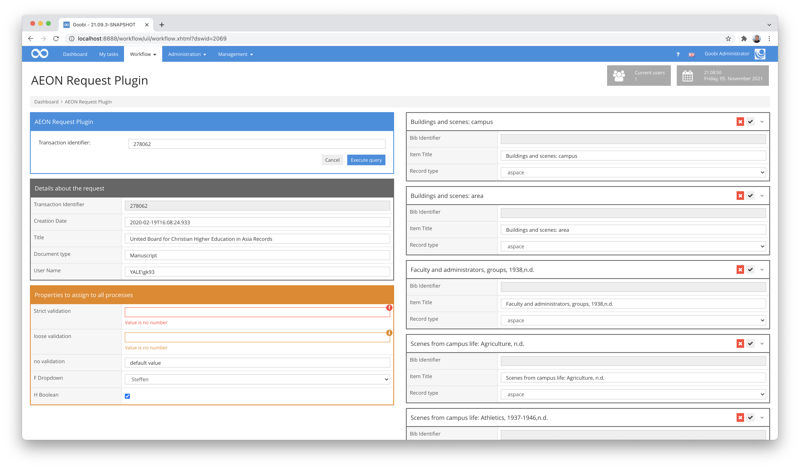
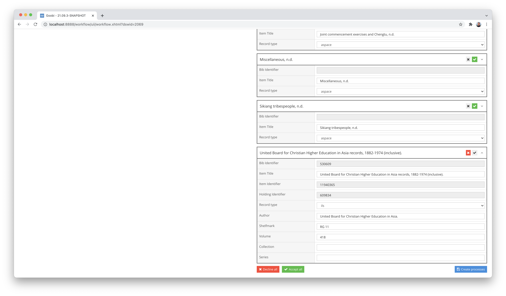
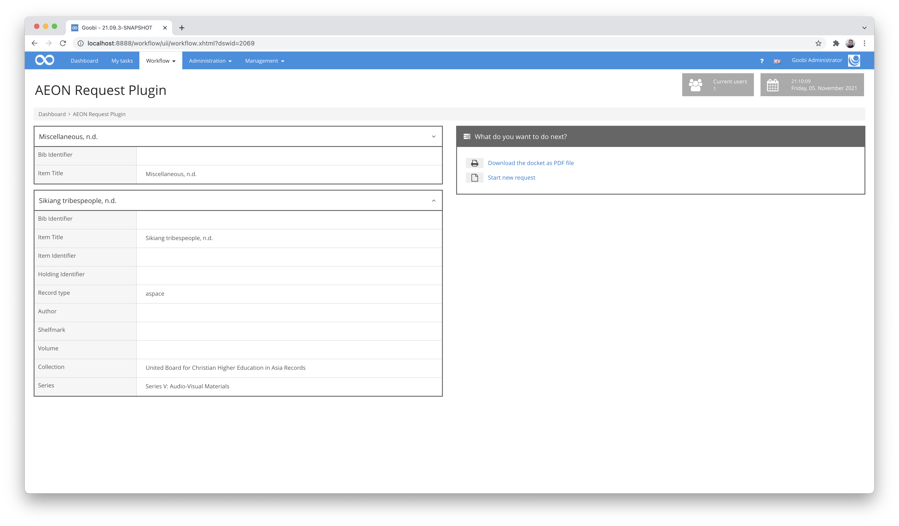
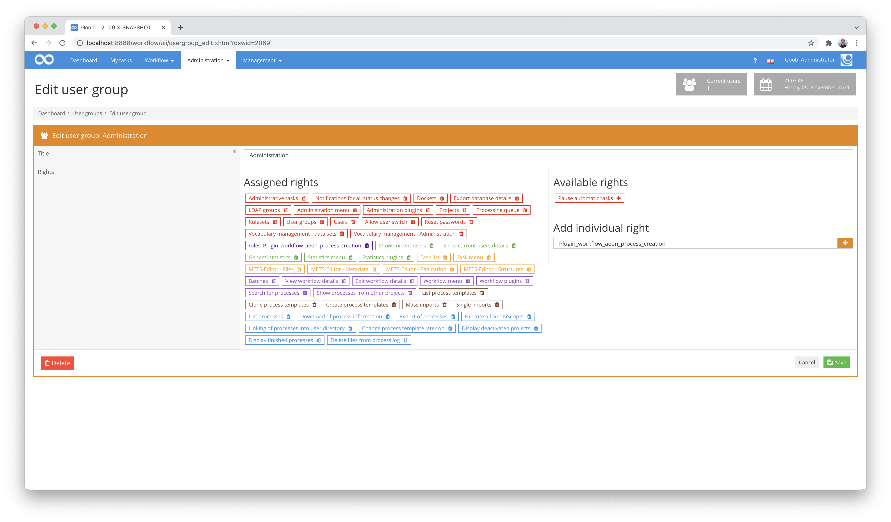

AEON data transfer
===========================================================================


Introduction
---------------------------------------------------------------------------
This plugin can be used to query individual data sets from AEON. After a record has been queried, all metadata from the so-called Metadata Cloud are retrieved and listed. The user can then select which data sets he or she would like to create as a Goobi operation.


Overview
---------------------------------------------------------------------------

Details             |  Explanation
------------------- | -----------------------------------------------------
Identifier          | intranda_workflow_aeon_process_creation
Source code         | [https://github.com/intranda/goobi-plugin-workflow-aeon-process-creation](https://github.com/intranda/goobi-plugin-workflow-aeon-process-creation)
Licence             | GPL 2.0 or neeer 
Documentation date  | 05.11.2021 


How the plugin works
---------------------------------------------------------------------------

If the user has the authorisation to use the plugin, the plugin `AEON Query Plugin` can be opened in the menu item `Worklow`.



A transaction identifier can now be entered here to start the search for an AEON record.



If a successful search was performed, the `query details` area was filled with the fields that were defined within the configuration in the `<transaction>` area. In the area `Properties for all transactions` the freely definable properties from the configuration area `<properties>` are displayed.

These fields can be edited if this has been provided for in the configuration file. Violations of the validation are displayed directly next to the individual fields.

In the right-hand area of the user interface, the individual data records found within the Metadata Cloud for the barcode of the AEON record are listed. Each box represents an independent data record. More details of a data record can be displayed by expanding further fields of the boxes. The corresponding icons per box can be used to select the data sets for which processes are to be generated in Goobi.



Provided at least one record has been selected and there are no unfulfilled strict validations, clicking on the `Create processes` button allows the user to create the individual Goobi processes for the selected records based on the configured process template. This then takes the user to another view.



The left-hand pane lists the records for which processes have been created in Goobi. The right-hand pane offers the option of generating and downloading a docket for all created processes, where the associated processes are all listed together within a common batch.

Installation
---------------------------------------------------------------------------
The plug-in consists of the following files to be installed:

```text
plugin_intranda_workflow_aeon_process_creation.jar
plugin_intranda_workflow_aeon_process_creation-GUI.jar
plugin_intranda_workflow_aeon_process_creation.xml
```

These files must be installed in the correct directories so that they are available under the following paths after installation:

```bash
/opt/digiverso/goobi/plugins/workflow/plugin_intranda_workflow_aeon_process_creation.jar
/opt/digiverso/goobi/plugins/GUI/plugin_intranda_workflow_aeon_process_creation-GUI.jar
/opt/digiverso/goobi/config/plugin_intranda_workflow_aeon_process_creation.xml
```


Configuration
---------------------------------------------------------------------------
The plugin is configured via the configuration file `plugin_intranda_workflow_aeon_process_creation.xml` and can be adapted during operation. The following is an example configuration file:

```xml
<config_plugin>
    <aeon>
        <url>https://example.com/api</url>
        <apiKey>1234567890</apiKey>
        <username>username</username>
        <password>password</password>
    </aeon>

    <processCreation>
        <workflowName>digitisation on demand</workflowName>
        <opacName>metadata cloud</opacName>
    </processCreation>

    <transaction>
        <field aeon="transactionNumber">
            <title>Transaction Identifier</title>
            <type readonly="true">input</type>
            <variable place="process">Transaction Identifier</variable>
            <help>This is my description for the field so that everyone gets some help.</help>
            <validation strict="true">\d+</validation>
            <message>Your content does not follow our validation guidelines</message>
        </field>

        <field aeon="creationDate">
            <title>Creation Date</title>
            <type readonly="false">input</type>
            <variable place="process">Creation date</variable>
            <help>This is my description for the field so that everyone gets some help.</help>
            <message>Your content does not follow our validation guidelines</message>
        </field>

        <field aeon="itemTitle">
            <title>Title</title>
            <type readonly="false">input</type>
            <variable place="process">Main title</variable>
            <value>Transmission</value>
            <help>This is my description for the field so that everyone gets some help.</help>
        </field>

        <field aeon="documentType">
            <title>Document type</title>
            <type readonly="false">input</type>
            <variable place="process">Doc type</variable>
            <help>This is my description for the field so that everyone gets some help.</help>
        </field>
    
        <field aeon="username">
            <title>User Name</title>
            <type readonly="false">input</type>
            <variable place="process">User</variable>
            <help>This is my description for the field so that everyone gets some help.</help>
        </field>
    </transaction>

    <properties>
        <field>
            <title>Strict validation example</title>
            <type readonly="false">input</type>
            <variable place="process">Strict field</variable>
            <value>no numeric value</value>            
            <help>This is my description for the field so that everyone gets some help.</help>
            <validation strict="true">\d+</validation>
            <message>Value is no number</message>
        </field>

        <field>
            <title>Loose validation example</title>
            <type readonly="false">input</type>
            <variable place="process">Loose field</variable>
            <value>no numeric value</value>
            <help>This is my description for the field so that everyone gets some help.</help>
            <validation strict="false">\d+</validation>
            <message>Value is no number</message>
        </field>

        <field>
            <title>no validation example</title>
            <type readonly="false">input</type>
            <variable place="process">Text field</variable>
            <value>default value</value>
            <help>This is my description for the field so that everyone gets some help.</help>
            <message>Your content does not follow our validation guidelines</message>
        </field>
        <field>
            <title>Dropdown example</title>
            <type readonly="false">select</type>
            <variable place="work">CoWorker</variable>
            <value>Steffen</value>
            <select>Steffen</select>
            <select>Oliver</select>
            <select>Robert</select>
            <help>This is my description for the field so that everyone gets some help.</help>
        </field>

        <field>
            <title>Vocabulary example</title>
            <type readonly="false">vocabulary</type>
            <variable place="work">Vocabulary</variable>
            <vocabularyName>Subject terms</vocabularyName>
            <vocabularyField>type=Person</vocabularyField>
            <help>This is my description for the field so that everyone gets some help.</help>
        </field>
        <field>
            <title>Boolean example</title>
            <type readonly="false">checkbox</type>
            <variable place="process">Status</variable>
            <value>true</value>
            <help>This is my description for the field so that everyone gets some help.</help>
        </field>
    </properties>
    
    <processes>
        <field aeon="bibId" displayAlways="true" displayInTitle="false">
            <title>Bib Identifier</title>
            <type readonly="true">input</type>
            <variable place="process">Text field</variable>
            <help>This is my description for the field so that everyone gets some help.</help>
        </field>
        <field aeon="title" displayAlways="true" displayInTitle="true">
            <title>Item Title</title>
            <type readonly="false">input</type>
            <variable place="process">Text field</variable>
            <help>This is my description for the field so that everyone gets some help.</help>
        </field>
        <field aeon="itemId" displayAlways="false" displayInTitle="false">
            <title>Item Identifier</title>
            <type readonly="true">input</type>
            <variable place="process">Text field</variable>
            <help>This is my description for the field so that everyone gets some help.</help>
        </field>
            <field aeon="holdingId" displayAlways="false" displayInTitle="false">
            <title>Holding Identifier</title>
            <type readonly="true">input</type>
            <variable place="process">Text field</variable>
            <help>This is my description for the field so that everyone gets some help.</help>
        </field>
        <field aeon="recordType" displayAlways="false" displayInTitle="false">
            <title>Record type</title>
            <type readonly="false">select</type>
            <variable place="work">publication</variable>
            <select>ils</select>
            <select>aspace</select>
            <help>This is my description for the field so that everyone gets some help.</help>
        </field>
        <field aeon="collection" displayAlways="false" displayInTitle="false">
            <title>Collection</title>
            <type readonly="false">input</type>
            <variable place="work">Text field</variable>
            <help>This is my description for the field so that everyone gets some help.</help>
        </field>
    </processes>
</config_plugin>
```

The access data is managed within the `<aeon>` area. The URL to the RESTful API of AEON as well as the user name and password must be stored here. If, alternatively, a key is to be used for the use of the API, this must be specified.

In the block `<processCreation>` it can be defined which OPAC configuration is to be used to request catalogue data and on the basis of which production template the individual processes are to be created.

This is followed by the configuration of the fields that are displayed and can be imported. This is divided into 3 areas. The area `<transaction>` contains those fields that are read from the AEON record. The area `<properties>` contains freely definable properties that belong to the transactions to be created. And the area `<processes>` contains the fields that were obtained from the Metadata Cloud when querying the data.

The configuration within the three areas is almost identical. Each field is defined by a `<field>` element. Within this, the following options are subsequently provided:

Parameter           |  Explanation
------------------- | ----------------------------------------------------- 
`title` | display name of the field
`type` | Type of the field, possible values are `input`, `select`, `vocabulary`, `checkbox`.
`readonly` | The values `true` or `false` define whether the content of the field may be edited.
`aeon` | Name of the json element from which the field is filled. This parameter is not evaluated for the freely definable properties.
`displayAlways` | The values `true` or `false` define whether the field is displayed when only a minimised record is displayed. This parameter is only evaluated for the fields from the Metadata Cloud.
`displayInTitle` | The values `true` or `false` define whether the field is listed within the header of the box. This parameter is only evaluated for the fields from the Metadata Cloud.
`variable` | This parameter defines the name of the property to be created. This parameter is not evaluated for data from the Metadata Cloud.
`place` | This parameter defines the type of the property. Possible values are `work` (workpiece property), `process` (process property), `template` (template property).
`value` | This parameter can be used to set a default value. If an AEON element is configured and obtained by the query, the configured default value is overwritten with the content from AEON.
`help` | This parameter can be used to define a help text that can optionally be displayed.
`validation` | This parameter defines a regular expression against which the field content can be validated.
`strict` | The values `true` or `false` define whether a validation violation must be resolved before operations can be created. 
`message` | This parameter specifies a message to be displayed in case of validation errors.
`vocabularyName` |  This parameter defines a vocabulary to be used. 
`vocabularyField` | The parameter `fieldname=value` can be used to restrict the hit set to values that meet this definition. The field is repeatable to define several restrictions at the same time.

Setting up required permissions
---------------------------------------------------------------------------
This plugin has its own permission level for use. For this reason, users must have the required permissions. Therefore, please assign the following right to the user group of the corresponding users:

```
Plugin_workflow_aeon_process_creation
```

